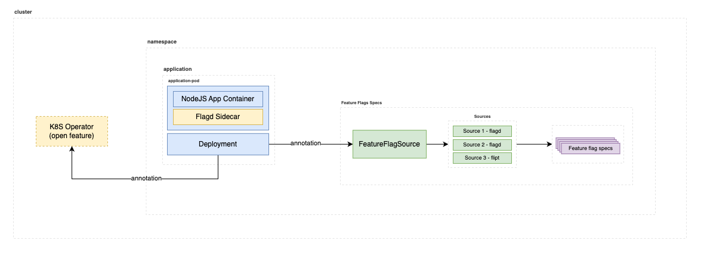

# Feature Flag Management - Research & Development

Este repositório contém um estudo comparativo (benchmark) e implementações de referência para avaliar diferentes soluções de gerenciamento de Feature Flags, com foco especial em ambientes Cloud Native e Kubernetes.

## Objetivo

O objetivo deste P&D é:
1. Avaliar e comparar as principais ferramentas de Feature Flag do mercado
2. Definir requisitos e features desejadas para um sistema de Feature Flags
3. Testar tecnologias através de implementações práticas
4. Explorar soluções cloud-native e integração com Kubernetes

## Soluções Analisadas

### Ferramentas de Mercado

| Solução | Tipo | Diferencial |
|---------|------|-------------|
| LaunchDarkly | Proprietário | Líder de mercado, suporte completo multi-stack |
| Split.io | Proprietário | Forte em analytics e experimentação |
| Flagsmith | Open Source | Self-hosted, boa documentação |
| Unleash | Open Source | Foco em enterprise, suporte a GitOps |
| GrowthBook | Open Source | Analytics avançado, A/B testing |
| OpenFeature | Open Source (CNCF) | Especificação padronizada, provider-agnostic |

### Comparativo Técnico

| Característica | LaunchDarkly | Split.io | Flagsmith | Unleash | GrowthBook | OpenFeature |
|---------------|--------------|-----------|------------|---------|------------|-------------|
| K8s Native | Não | Não | Não | Parcial | Não | Sim |
| YAMLs Declarativos | Não | Não | Não | Sim | Não | Sim |
| Self-hosted | Não | Não | Sim | Sim | Sim | N/A |
| GitOps Ready | Parcial | Parcial | Não | Sim | Não | Sim |
| Multi-tenant | Sim | Sim | Sim | Sim | Sim | N/A |
| A/B Testing | Sim | Sim | Sim | Sim | Sim | Via Provider |

## Requisitos Essenciais Identificados

### Funcionais
- Consistência na distribuição de flags
- Rollouts graduais e controlados
- Sistema de targeting/segmentação
- Monitoramento e analytics
- UI para gerenciamento
- Suporte multi-linguagem (SDKs)

### Não-Funcionais
- Performance e baixa latência
- Fallback seguro offline
- Cache eficiente
- Auditoria de mudanças
- Escalabilidade
- Segurança e compliance

### Cloud Native
- Integração nativa com Kubernetes
- Suporte a GitOps
- Configuração declarativa (YAMLs)
- Métricas Prometheus
- Observabilidade

## Análise de Requisitos Detalhada

### 1. Componentes Essenciais de um Sistema de Feature Flags

#### Core Features
- **Gestão de Flags**
  - Tipos flexíveis (boolean, number, string, JSON)
  - Estados por ambiente (dev/stg/prod)
  - Regras de override
  - Targeting e segmentação

#### Estratégias de Deploy
- **Rollout Gradual**
  - Liberação progressiva baseada em tempo
  - Controle por parâmetros customizados
- **Canary Release**
  - Percentual de usuários
  - Monitoramento de métricas
- **Testes Beta**
  - Beta fechado (lista de usuários)
  - Beta aberto (opt-in)
- **Dark Launch**
  - Integração sem exposição
  - Testes de carga reais

#### Experimentação
- **A/B Testing**
  - Segmentação por critérios
    - Localização
    - Dispositivo
    - Metadados customizados
  - Análise de resultados
  - Métricas de conversão

#### Aspectos Técnicos
- Hash determinístico
- Cache eficiente
- Fallback offline
- Alta disponibilidade
- Baixa latência

### 2. Análise de Mercado

#### Players Principais
1. **Soluções Enterprise (Proprietárias)**
   - LaunchDarkly: Líder de mercado, recursos enterprise
   - Split.io: Foco em analytics e experimentação
   - Optimizely: Especialista em A/B testing

2. **Soluções Open Source**
   - Unleash: Foco enterprise, suporte comercial
   - GrowthBook: A/B testing avançado
   - OpenFeature: Especificação CNCF
   - Flagsmith: Self-hosted completo
   - PostHog: Analytics + feature flags
   - Flipt: Simplicidade e performance
   - FeatBit: UI moderna, foco em equipes

### 3. Requisitos Específicos TOTVS

#### Requisitos Técnicos
1. **Suporte Multi-Stack**
   - Frontend: Angular
   - Backend: Java, C#, Node.js, Go, Python
   - Mobile: Ionic

2. **Arquitetura**
   - Multi-tenant
   - Isolamento por serviço
   - Alta disponibilidade
   - Escalabilidade horizontal

3. **Integração**
   - OAuth/SSO
   - API Gateway
   - SDKs oficiais
   - Webhooks

#### Requisitos de Negócio
1. **Governança**
   - RBAC (Role-Based Access Control)
   - Auditoria completa
   - Compliance (LGPD)
   - Ambientes segregados

2. **Operacional**
   - UI para gestão
   - Documentação em português
   - Suporte enterprise
   - SLA definido

3. **Custos**
   - TCO previsível
   - Modelo de licenciamento claro
   - Custos por volume
   - ROI mensurável

### 4. Considerações Adicionais TOTVS

#### Integração com Ecossistema
1. **DevOps**
   - CI/CD Pipeline
   - GitOps workflow
   - IaC (Infrastructure as Code)
   - Monitoramento centralizado

2. **Segurança**
   - Criptografia em trânsito e repouso
   - Backup e DR
   - Controle granular de acesso
   - Scanning de vulnerabilidades

3. **Observabilidade**
   - Métricas Prometheus
   - Logs centralizados
   - Tracing distribuído
   - Dashboards Grafana

#### Aspectos Culturais
1. **Capacitação**
   - Treinamento para times
   - Documentação clara
   - Exemplos práticos
   - Suporte em português

2. **Governança**
   - Políticas de uso
   - Best practices
   - Padrões de nomenclatura
   - Processos de aprovação

## Implementações de Referência

Este repositório contém exemplos práticos de implementação usando diferentes soluções:

1. **OpenFeature com Flagd**
   - Demonstração de feature flags usando OpenFeature Operator e Flagd Standalone
   - Implementação cloud-native com Kubernetes
   - Exemplo em Node.js com suporte a métricas Prometheus

Exemplo da arquitetura testada:

2. **GrowthBook**
   <!-- - Exemplo de A/B testing -->
   - Implementação self-hosted
   - Integração com MongoDB
   - Exemplo em Node.js

## Como Usar

Cada implementação possui sua própria documentação detalhada:
- [OpenFeature Implementation](./open-feature-01/README.md)
- [GrowthBook Implementation](./growthbook-01/README.md)

## Conclusões e Recomendações

### Pontos Fortes do OpenFeature
- Especificação padronizada CNCF
- Evita vendor lock-in
- Excelente integração com Kubernetes
- Suporte a múltiplos providers
- Possui operator (flagd) para Kubernetes

### Pontos Fortes do GrowthBook
- UI intuitiva
- Forte em A/B testing
- Boa documentação
- Opção self-hosted gratuita
- Setup inicial simples
